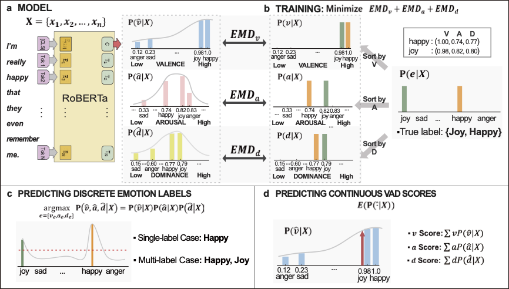

# Dimensional Emotion Detection from Categorical Emotion Annotation
[**Paper**](https://arxiv.org/abs/1911.02499) |
[**Dataset Preparation**](#Dataset-Preparation) | [**Traning**](#Traning) | [**Results**](#Results) |
[**Citation**](#Citation) | [**Contact**](#Contact)

> **Abstract:** We present a model to predict fine-grained emotions along the continuous dimensions of valence, arousal, and dominance (VAD) with a corpus with categorical emotion annotations. Our model is trained by minimizing the EMD (Earth Mover's Distance) loss between the predicted VAD score distribution and the categorical emotion distributions sorted along VAD, and it can simultaneously classify the emotion categories and predict the VAD scores for a given sentence. We use pre-trained RoBERTa-Large and fine-tune on three different corpora with categorical labels and evaluate on EmoBank corpus with VAD scores. We show that our approach reaches comparable performance to that of the state-of-the-art classifiers in categorical emotion classification and shows significant positive correlations with the ground truth VAD scores. Also, further training with supervision of VAD labels leads to improved performance especially when dataset is small. We also present examples of predictions of appropriate emotion words that are not part of the original annotations.

This repository contains the source code for the paper [Toward Dimensional Emotion Detection from Categorical Emotion Annotations](https://arxiv.org/abs/1911.02499),
which is accepted by EMNLP 2021.
In this work, we present a model to predict fine-grained emotions along the continuous dimensions of valence, arousal, and dominance (VAD) with a corpus with categorical emotion annotations. We use pre-trained RoBERTa-Large and fine-tune on three different corpora with categorical labels and evaluate on EmoBank corpus with VAD scores.
Please refer to the paper for more details.

Overview of approach:



## Dataset Preparation
In this work, we use four existing datasets consisting of text and corresponding emotion annotations. Three of them have categorical emotion labels, and the last is annotated with VAD scores. We summarize the key information of these datasets and provide the links to download these datasets if they are directly accessible.
|   Dataset  |  Size  | # Emotions |              Type             |                                        Download Link                                       |
|:----------:|:------:|:----------:|:-----------------------------:|:------------------------------------------------------------------------------------------:|
|   SemEval  | 10,983 |     11     |  multi-labeled classification | [**link**](https://competitions.codalab.org/competitions/17751#learn_the_details-datasets) |
|    ISEAR   |  7,666 |      7     | single-labeled classification |     [**link**](http://www.affective-sciences.org/index.php/download_file/view/395/296/)    |
| GoEmotions | 58,009 |     28     |  multi-labeled classification |    [**link**](https://github.com/google-research/google-research/tree/master/goemotions)   |
|   EmoBank  | 10,062 |    V,A,D   |           regression          |             [**link**](https://github.com/JULIELab/EmoBank/tree/master/corpus)             |


## Traning
### Dependencies Requirements
```bash
pip install -r requirements.txt
```
### Running Baseline Model (Pretrained RoBERTa-Base)

#### Classification
```bash
python src/main.py --config configs/baseline/semeval_cat_classification.json
```

#### Regression
```bash
python src/main.py --config configs/baseline/emobank_dim_regression.json
```

### Running Our Model

#### Classification & Zeroshot VAD prediction
```bash
python src/main.py --config configs/semeval/vad_from_categories.json
```

#### Regression
```bash
python src/main.py --config configs/semeval/vad_regression.json
```
## Results
### Performance of EmoBank VAD score prediction
With fine-tuning pre-trained RoBERTa-Large, we show significant positive correlations with VAD scores using only the categorical emotion annotations. If those models are continuously fine-tuned on EmoBank, it outperforms all SOTA VAD regression models.
| Model             | Scheme     | V(r) | A(r) | D(r) |
|-------------------|------------|------|------|------|
| Baseline, SemEval | Zero-shot  | **.715** | **.319** | .319|
| Baseline, ISEAR   | Zero-shot  | .611 | .083 | .242 |
| Baseline, GE      | Zero-shot  | .630 | .277 | **.311** |
| AAN               | Supervised | .424 | .352 | .265 |
| Ensemble          | Supervised | .635 | .375 | .277 |
| SRV-SLSTM         | Semi-super | .620 | .508 | .333 |
| RoBERTa-Large     | Supervised | .829 | .569 | .513 |
| Ours, EB←SemEval  | Supervised | **.838** | .570 | .518 |
| Ours, EB←ISEAR    | Supervised | .836 | .568 | **.536** |
| Ours, EB←GE       | Supervised | .835 | **.573** | .529 |


### Performance of categorical emotion classification
With fine-tuning pre-trained RoBERTa, we show comparable performance to SOTA models in classification.
| Dataset (Model)         | Macro F1 | Micro F1 | Acc. |
|-------------------------|:--------:|:--------:|:----:|
| ISEAR (MT-CNN)          |        - |     .668 |    - |
| ISEAR (Baseline)        |     .754 |     .755 |    - |
| ISEAR (Ours)            |     .752 |     .753 |    - |
| SemEval (NTUA-SLP)      |     .528 |     .701 | .588 |
| SemEval (Seq2Emo)       |        - |     .709 | .592 |
| SemEval (RoBERTa-Large) |     .574 |     .725 | .607 |
| SemEval (Ours)          |     .566 |     .725 | .607 |
| GoEmotions              |     .640 |        - |    - |
| GoEmotions (Baseline)   |     .618 |     .691 | .659 |
| GoEmotions (Ours)       |     .611 |     .686 | .657 |

## Citation
```bibtex
@article{park2019toward,
  title={Toward dimensional emotion detection from categorical emotion annotations},
  author={Park, Sungjoon and Kim, Jiseon and Jeon, Jaeyeol and Park, Heeyoung and Oh, Alice},
  journal={arXiv preprint arXiv:1911.02499},
  year={2019}
}
```

## Contact
Please contact {sungjoon.park, jiseon_kim, vano1205}@kaist.ac.kr or raise an issue in this repository.
